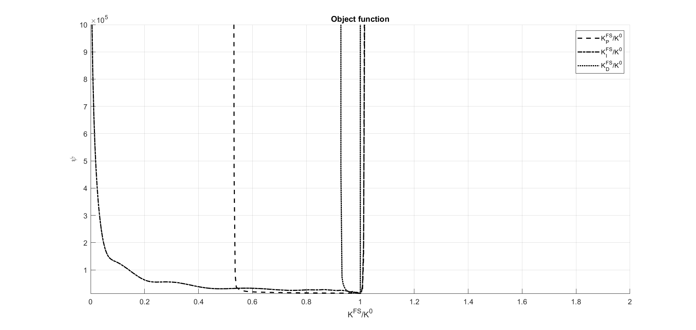

# RIVA
Road-profile Inversion based on in-Vehicle Accelerations (RIVA) is a MATLAB-package for road profile estimation based on data from vertical acceleration traces.

The framework for performing the inversion is visualized in Figure 1; the scheme refers to a vehicle that is instrumented with an accelerometer positioned near the centre-line close to the front axle. The inversion is achieved using a PID controller algorithm with a calibrated quarter-car model; it can take any synthetic or field-measured acceleration and speed signal as input. The outcome of this process is followed by a filtering step to remove long wavelengths. A detailed description of the proposed methodology including model verification and validation of RIVA is presented in [Skar and Levenberg (2023)].

<div>

</div>
<p>
 <b>Figure 1:</b> Overview of the proposed method.
</p>

RIVA is based on matching measured vertical accelerations acquired over a specific road stretch with accelerations simulated by the calibrated quarter-car model. The matching is done with a PID control algorithm (see Figure 2), considering the road profile as an unknown 'input' and the measured accelerations as 'target' signal. The physics of the quarter-car model governs the 'transfer function' relating input to output. 

<div>

</div>
<p>
 <b>Figure 2:</b> Block diagram of the closed feedback loop PID controller utilized in RIVA. 
</p>

The components of the RIVA software is briefly described below:
* `main.m` - main script for defining vehicle, importing accelerometer data, and post-processing of the results. 

* `qcar_acc_ms_tvar.m` - script for simulating a syntehtic acceleration trace based on a known vehicle and road profile.

* `PID_profile_inv_tvar.m` - script for road profile inversion based on measured accelerations.

*  `PID_profile_out_tvar.m` - script for plotting final optimal solution after the optimization process.

*  `pid_control.mat` - road profile data.

## Synthetic example and verification
The example script (i.e., 'main.m' script) provided is named 'RIVA_insilico.m'. This script provides a syntetic verification of the RIVA MATLAB-package, with the purpose to ensure that the code/method offers favorable convergence conditions for an optimization algorithm. 

The script focuses on an ideal scenario where the data used as input is synthetically manufactured. The filtered input signal (i.e., road profile) is shown as a dashed blue line in Figure 3; it is slightly smoothed compared to the original signal due to the ‘enveloping’ effect of the tire (i.e., length of the tire-pavement contact area). The result of this effect is highlighted in the magnified view in the right top corner of Figure 3.

<div>

</div>
<p>
 <b>Figure 3:</b> Road profile used forverification: (a) synthetic road events, and (b) road events randomly distributed over a 50 m section. The original synthetic road profile and the filtered input signal are shown as a black line and a blue line, respectively.
</p>

Figure 4 presents the outcome of the road profile inversion. The synthetically generated 'true' acceleratio and input road profile are shown as solid grey lines. The corresponding calculated acceleration $\ddot{z}_s^c$ and the inverted road profile are shown as a black dashed lines. As can be seen, the signals overlap, indicating that Equation \ref{eqn:optalg} was optimally solved, and that the proposed inversion method works with synthetic inputs.

<div>

</div>
<p>
 <b>Figure 3:</b> Road profile used forverification: (a) synthetic road events, and (b) road events randomly distributed over a 50 m section. The original synthetic road profile and the filtered input signal are shown as a black line and a blue line, respectively.
</p>

## Installation
* Download the package on your PC. 
* Open MATLAB
* Go to the directory 'RIVA'
* add the different directories of the RIVA on your MATLAB path — Now you are ready to run the validation examples provided and generate your own analysis. 
* RIVA is compatible with [OCTAVE](https://www.gnu.org/software/octave/index)

For example validation of the library can be launched with

``` matlab
addpath("basic")
addpath("examples")
RIVA_insilico
```

## How to contribute
*	To make changes or add a new function: <i>(i)</i> For the repository (make your own separate copy), <i>(ii)</i> make changes, and <i>(iii)</i> open a 'pull request'. Once approved, it can be merged into the master branch. If you wish to chat beforehand about your contribution, open an issue or email to asmusskar@gmail.com.
*	If you find a bug in the code: open an 'issue' to notify contributors and create an official record.

Before contributing, please consider how your function fits into RIVA. At a minimum, functions must be well-documented and compatible with [OCTAVE](https://www.gnu.org/software/octave/index), not using any third party components. 

# References
Skar, Asmus and Levenberg, Eyal (2023). Road Profile Inversion from In-Vehicle Accelerometers. Transp. Eng. Part B Pavements (in press)

